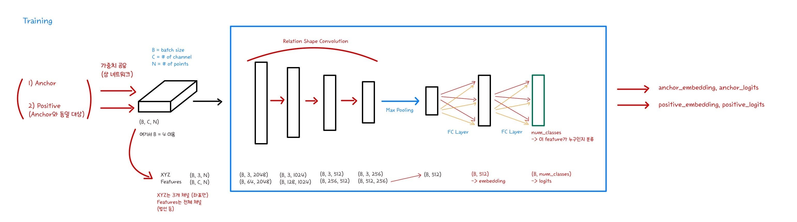
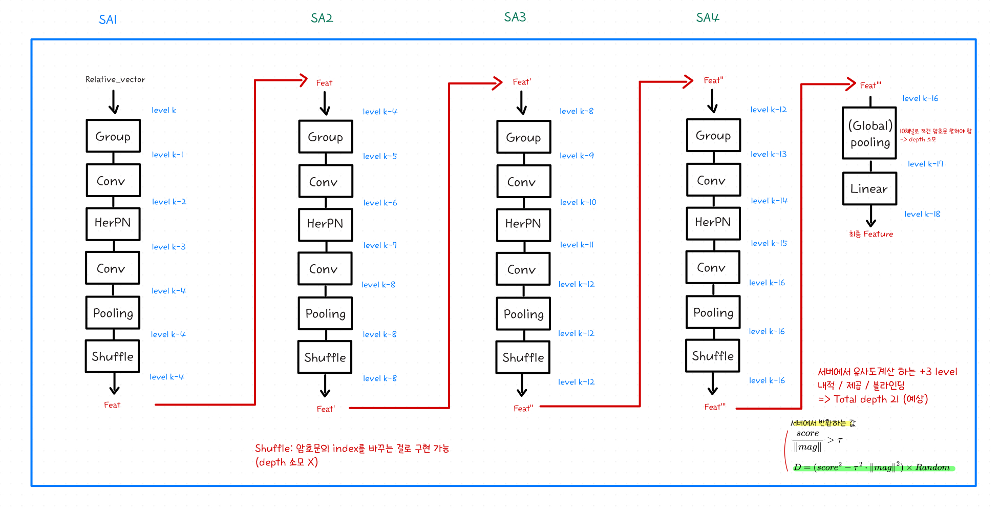

# Encrypted 3D-Face-Recognition

암호화된 3D Face-Recognition

------
## A. Introduction
1. **프로젝트 배경**
3D 데이터(여기서는 point cloud 형태의 데이터)로 구성되어있는 얼굴 인식 시스템을 구현하고 암호화한 아키텍처를 제시함    
이게 얼마나 성능이 나올까?에 대해 알아보고 클라이언트-서버 간 구조를 제시   
*중앙대학교 2025학년도 동계 SW·AI학부연구생 프로그램 대상   
    
2. **Base가 되는 논문**
_**PointFace: Point Cloud Encoder-Based Feature Embedding for 3D Face Recognition**_      
_Changyuan Jiang , Shisong Lin , Wei Chen , Feng Liu , Member, IEEE, and Linlin Shen , Senior Member, IEEE_      
_IEEE TRANSACTIONS ON BIOMETRICS, BEHAVIOR, AND IDENTITY SCIENCE, VOL. 4, NO. 4, OCTOBER 2022_      
해당 논문에서 제시하는 PointFace 아키텍처를 구현하고 이를 HE-Friendly하게 수정해서 사용함 (공식 소스코드가 없음)

- `PointFace_v1`: 원 논문의 구조를 최대한 재현한 버전 (공식 아님)
- `PointFace_v6`, `PointFace_v7`: Point Transformer 계열의 아이디어를 적용한 경량 변형
- `PointFace_v8`: 샘플링 수와 모델 용량을 확장해 정확도를 보완한 현재 구조

> 이 저장소는 연구 및 실험 목적으로 작성되었습니다. 데이터셋은 저장소에 포함되어 있지 않습니다.

## B. Preliminary

### Homomorphic Encryption
동형 암호(Homomorphic Encryption)이란, 암호문(Ciphertext)인 상태로 연산이 가능한 암호를 말함
수식으로 표현하면 다음과 같음

$$
DEC(ENC(x) \ \Delta \ ENC(y)) = x \ \Delta \ y
$$

Encryption(암호화)시에 r(noise, error)를 넣음
→ 연산 시마다 error가 커지게 됨

그래서 연산 깊이(depth)를 정해놓는 경우가 있음
=> 이 횟수를 넘어가면 오차가 커져서 원래대로 복호화하지 못함


## C. Overall Architecture
</img>
_**Figure 1.** Overall Architecture_        

```text
Point cloud (N × 3)
  → sampling / unit-sphere normalization
  → Morton(Z-order) sorting
  → SA blocks × 4
  → multi-scale max pooling & concatenation
  → FC + BatchNorm
  → L2-normalized 512-D embedding
  → cosine-similarity matching
```


1차 목표는 최종 Feature만 encrypted domain에서 매칭하는 것이었고, 최종 목표는 전체를 end-to-end encrypted domain에서 처리하고자 하였음

</img>
_**Figure 2.** Overall Pipeline_        

기존의 PointFace에서 제안하는 구조는 RSConv라는 구조로, FPS(Farthest Point Sampling)을 이용해야 했으나, 이를 동형 암호 상태에서 처리하기는 어렵다고 판단하였고, 이를 근사하고자 하였음.     
이를 위해 Morton 정렬을 이용해서 공간적인 정보를 근사하고, Grouped Convolution과 ShuffleNet의 아이디어를 이용해서 경량화하고자 하였음(Point Transformer 논문에서 제시하는 구조와 유사함)    

## D. Experiment
**[11th Gen Intel(R) Core(TM) i5-1135G7 @ 2.40 GHz (8 CPUs), 16GB Ram, Windows 11]** 기준 
### Dataset
**UMB-DB**    
143명 
1473 total acquisitions (3D + colour 2D)      
120명의 데이터를 학습에 사용, 나머지 23명의 데이터를 추론에 사용함      

**FaceScape**    
847명 * 20개의 표정     
16940 total acquisitions (3D)      
700명의 데이터를 학습에 사용, 나머지 147명의 데이터를 추론에 사용함      

### Encoder Training


동일 인물의 neutral/표정 데이터를 positive pair로 구성하고, ArcFace head를 사용한 분류 손실과 supervised contrastive loss를 함께 최적화함

$$
L_{total}=L_{ArcFace}+\lambda L_{SupCon}
$$

기본 설정은 `learning_rate=0.001`, `margin=0.35`, `\lambda=1.0`이며, ArcFace margin warm-up과 cosine annealing warm restarts를 사용함

### Unseen Test
모델이 잘 학습되었는지를 확인하기 위해서 Unseen Test를 수행      
학습에 사용하지 않은 데이터를 이용해서 얼굴 쌍에 대해 유사도를 계산함
| | FaceScape | UMB-DB |
|---|---|---|
| v6 |  |  |
| v7 |  |  |
| v8 |  |  |

### Matching Result

동일 인물의 여러 얼굴 데이터를 넣고 템플릿을 추출한 후 평균을 구해서 DB에 저장하고, 암호화는 **CKKS 스킴의 동형 암호(Homomorphic Encryption)** 를 사용함 (PointFace_v1 기준)

* **Matching (without ENC)**
템플릿 암호화 없이 1:1 매칭시킨 결과 (Average)

    |  Preprocessing  |   Extracting Embedding   |  Matching  |  Total  |
    |:----------:|:-----------:|:-----------:|:-----------:|
    |  0.0047 sec  |   1.2199 sec   |   0.0003 sec   |  1.2254 sec   |


* **Matching (with FHE)**
템플릿 암호화 후 1:1 매칭시킨 결과 (Average)

    |  Preprocessing  |   Extracting Embedding   |  Encrypting  |  Matching  |  Total  |
    |:----------:|:-----------:|:-----------:|:-----------:|:-----------:|
    |  0.0037 sec  |   1.2779 sec   |   0.0065 sec   |  0.0228 sec   |  1.3115 sec   |

### 버전별 결과

서로 다른 데이터셋으로 평가된 원 논문 수치와 이 저장소의 결과는 직접적인 동등 비교가 아니라 참고용 (200 epoch 기준)

| 구조 | 입력 점 | 파라미터 | 연산량 | UMB-DB Rank-1 | FaceScape Rank-1 |
|---|---:|---:|---:|---:|---:|
| PointFace 논문 | 5,000 | 1.8M | 1.25 GFLOPs | - | - |
| PointFace 재현 추정치 (v1) | 5,000 | 0.558M | 1.238 GFLOPs | 82.91% | 99.75% |
| PointFace v6 | 1,024 | 0.350M | 0.019 GFLOPs | 73.37% | 85.26% |
| PointFace v7 | 1,024 | 1.228M | 0.061 GFLOPs | 74.87% | 91.64% |
| **PointFace v8** | **4,096** | **약 1.333M** | **0.151 GFLOPs** | **78.39% (156/199)** | **97.26% (2698/2774)** |

v8은 PointFace 대비 파라미터 수를 약 27%, 연산량을 약 88% 줄였고, 동일 실험 환경에서 측정한 1회 추론 시간은 약 `0.006 s`로, 기존 재현 구조의 약 `0.03 s`보다 약 5배 빨랐음. 다만 FPS를 Morton 정렬로 근사하면서 정확도 손실이 발생하므로, 이 구조의 핵심은 정확도와 연산 비용 사이의 trade-off로 볼 수 있음.


## E. Client-Server Architecture
현재 제안하는 클라이언트 - 서버 구조는 아래 그림과 같음      
</img>
_**Figure 3.** Client-Server Architecture_   


현재 구조는 클라이언트에서 특징 추출 -> 서버에서 연산 후 Threshold를 넘었는지 0 1로만 제공 -> 클라이언트가 복호화해서 결과 확인하는 구조

1. Client #1
    |  Preprocessing  |   Extracting Embedding   |  Encrypting  |  Total  |
    |:----------:|:-----------:|:-----------:|:-----------:|
    |  0.0034 sec  |   1.1521 sec   |   0.0055 sec   |  1.1610 sec   |

2. Server
    |   Matching   |  Total  |
    |:-----------:|:-----------:|
    |   0.0232 sec   |   0.0232 sec   |

3. Client #1
    |  Decrypting  |  Total  |
    |:----------:|:-----------:|
    |  0.0006 sec  |   0.0006 sec   |


여기에서 더 나아가서, 최종 목표는 FHE를 이용한 end-to-end Encrypted Matching을 하고자 하였고, 이를 위해 현재 구조는 다음과 같이 FHE 친화적으로 설계되어 있음
- Morton 정렬 이후의 그룹화는 reshape, 덧셈, 평균 등 선형 연산 위주로 구성
- max pooling 대신 sum pooling을 사용
- Activation Function은 CKKS에서 계산 가능한 저차 다항식 HerPN 사용
- OpenFHE의 CKKS scheme을 이용한 암호화 입력, 서버 추론 및 암호화 결과 반환 구조 실험
  

- Ring Dimension : 32768 (2^15)
- First mod size : 60
- Scaling mod size : 33
다만 현재 구조로는, 1회 추론에 약 400초 정도가 소요됨 (행렬 연산을 최적화하기위해 FSGS, folding 등등을 해봤으나 이 정도가 한계였음)

## F. Analysis


## G. Conclusion


------
## Reference

1. C. Jiang et al., “PointFace: Point Cloud Encoder-Based Feature Embedding for 3-D Face Recognition,” *IEEE TBIOM*, 2022. [DOI](https://doi.org/10.1109/TBIOM.2022.3197437)
2. C. R. Qi et al., “PointNet++: Deep Hierarchical Feature Learning on Point Sets in a Metric Space,” 2017. [arXiv](https://arxiv.org/abs/1706.02413)
3. X. Wu et al., “Point Transformer V3: Simpler, Faster, Stronger,” *CVPR*, 2024. [DOI](https://doi.org/10.1109/CVPR52733.2024.00463)
4. P. Khosla et al., “Supervised Contrastive Learning,” *NeurIPS*, 2020. [arXiv](https://arxiv.org/abs/2004.11362)
5. J. Park et al., “AESPA: Accuracy Preserving Low-degree Polynomial Activation for Fast Private Inference,” 2022. [arXiv](https://arxiv.org/abs/2201.06699)
6. X. Zhang et al., “ShuffleNet: An Extremely Efficient Convolutional Neural Network for Mobile Devices,” *CVPR*, 2018. [DOI](https://doi.org/10.1109/CVPR.2018.00716)
7. H. Yang et al., “FaceScape: A Large-Scale High Quality 3D Face Dataset,” *CVPR*, 2020. [DOI](https://doi.org/10.1109/CVPR42600.2020.00068)
8. A. Colombo et al., “UMB-DB: A Database of Partially Occluded 3D Faces,” *ICCV Workshops*, 2011.
------
## Appendix
## Install Guide

Python 가상환경 사용을 권장

```bash
python -m venv .venv
source .venv/bin/activate
pip install -r requirements.txt
```

주요 의존성은 PyTorch, NumPy, Matplotlib, Open3D, OpenFHE Python binding이고, GPU가 있으면 CUDA를 자동으로 사용하고, 없으면 CPU로 실행

## 데이터 준비

각 데이터는 `(N, 3)` 이상의 XYZ 좌표를 가진 NumPy 배열(`.npy`)이고, 디렉터리는 인물 ID별로 구성

```text
dataset/
└── umbdb/
    ├── person_001/
    │   ├── neutral.npy
    │   └── expression_01.npy
    └── person_002/
        ├── neutral.npy
        └── expression_01.npy
```

학습 pair는 각 ID의 파일명에 `neutral`이 포함된 샘플을 anchor로 우선 사용하고, 해당 파일이 없으면 정렬된 첫 번째 파일이 anchor가 됨. 학습/평가 데이터 경로, 클래스 수, 체크포인트 저장 위치는 `config.py`에서 환경에 맞게 수정해야 함

## Execution Guide
### 학습

```bash
python train.py
```

체크포인트는 기본적으로 10 epoch마다 `CONFIG["PATH"]["checkpoint_dir"]`에 저장됨

### Unseen verification 평가

```bash
python unseen_test.py
```

동일/상이 인물 쌍의 cosine similarity를 계산하고 best threshold, EER, FAR/FRR과 분포 그래프를 출력함

### Rank-1 평가

```bash
python measure_rank1.py
```

각 ID의 neutral 샘플을 우선 gallery로 사용하고 나머지를 probe로 평가함

### 평문 얼굴 매칭

```bash
python matching.py
```

각 ID의 임베딩 평균을 gallery template로 등록한 뒤 cosine similarity 기반 1:1 인증을 수행함. 기본 threshold는 `config.py`의 `MATCHING.threshold`에서 설정함